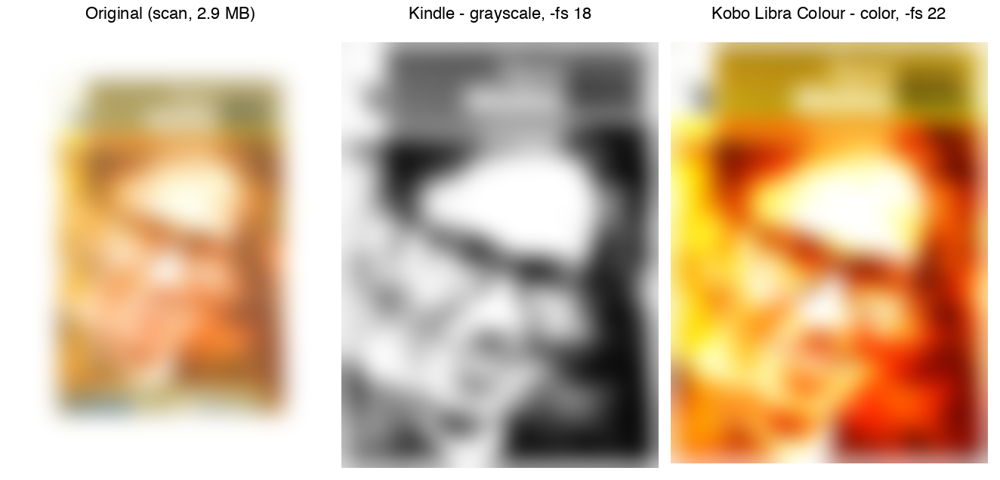
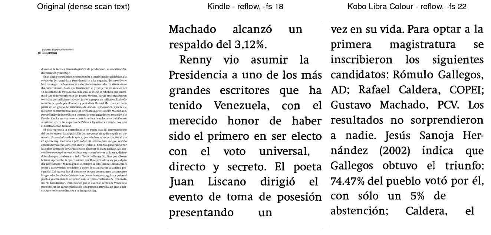

🇪🇸 [Leer en español](README.es.md)

# k2pdfopt

A Claude Code skill that converts scanned/native PDF books into Kindle- and
Kobo-ready PDFs with [k2pdfopt](https://www.willus.com/k2pdfopt/), then
verifies the result by sampling rendered pages instead of trusting the
conversion blind — or rendering all of them.


*Real conversion, same book: 2.9 MB / 140-page scan → 51.3 MB / 727-page
grayscale Kindle output (`-fs 18`) and 97.8 MB / 717-page color Kobo Libra
Colour output (`-fs 22`). Cover photo and publisher logos blurred here for
copyright reasons — the source book isn't ours to redistribute; the point
is the grayscale/color contrast, which survives the blur.*

## The problem

A PDF built for print or scanned from a physical book does not read well on
a 6-7" e-ink panel: tiny justified text, margins sized for 8.5x11 paper, and
sometimes JPEG2000-encoded scan images that not every reader decodes. A
single `k2pdfopt` invocation isn't enough on its own, either — you have to
pick the right mode/device profile/DPI for the *target device*, and on a
700+ page reflowed output you have no practical way to confirm nothing
broke without opening the whole book.

## What the skill does

1. **Resolves the k2pdfopt binary** — no Homebrew formula exists for it (see
   below), so this is a real step, not a formality.
2. **Inspects the source PDF** — page count, whether it's a real text layer
   or a pure scan, whether it embeds JPEG2000 images.
3. **Pre-flattens JPEG2000 scans to JPEG** when needed — some k2pdfopt
   builds don't decode JP2 reliably; poppler does, so it's used as a
   pre-pass instead of gambling on silent corruption.
4. **Picks target device(s)** — Kindle, Kobo Libra, or both.
5. **Calibrates large-print settings**, only if asked — font size in points
   is tuned per device (see below for why that's not a constant), with an
   optional visual size picker.
6. **Runs k2pdfopt in the background**, in parallel per device — real books
   take 60-150+ seconds, well past a typical foreground command timeout.
7. **Verifies the result by sampling**, not by rendering the whole book —
   see next section.
8. **Reports** file paths, sizes, sample coverage, and any caveats.

## Before / after: reflowed text


*Same idea, a body-text page: the original wastes most of the page on
margins around small justified text; both outputs reflow it into large,
evenly-spaced text sized for their panel. Kindle and Kobo needed **different**
`-fs` (font size in points) to land on the same target line count — a taller
panel fits more lines at the same font size, which is not obvious until you
measure it. See [`reference/decision-guide.md`](reference/decision-guide.md).*

## How the result gets verified

Rendering and inspecting every page of a 1500-page book would burn a
prohibitive number of tokens — and most conversion defects (wrong device
profile, broken column detection, a font size that's too small) are
*systemic*: they show up on most pages, not one random page. That reframes
the question from "estimate the defect rate precisely" (needs hundreds of
samples, and the sample size *grows* with the book) to "if a problem
affects at least P% of pages, what's the fewest pages I need to check for a
C% chance of catching it at least once?" — which does **not** grow with the
book's length:

```
n = ceil( ln(1 - C) / ln(1 - P) )
```

With the defaults (C=95%, P=10%) that's **~29 pages**, whether the book is
40 pages or 1500. Sampled pages get grouped into 1-3 labeled contact sheets
instead of read one image at a time, so reviewing ~30 pages costs a couple
of image reads, not thirty.

**Honest trade-off**: this catches recurring/systemic problems, not a
single one-off bad page buried in an otherwise-fine book. That's the
deliberate cost of not rendering the whole thing — see
[`reference/quality-checklist.md`](reference/quality-checklist.md) for the
full checklist and math.

## Requirements / installation

**There is no Homebrew formula for k2pdfopt.** `brew install k2pdfopt` will
always fail — confirmed, don't retry it. See
[`reference/installation.md`](reference/installation.md) for the real
options (an existing binary, the official precompiled build, or compiling
from source with Homebrew-provided dependencies).

Also needed: `poppler-utils` (`pdfinfo`, `pdftoppm`, `pdfimages`,
`pdffonts`, `pdftotext`) and Python 3 with Pillow, both for the skill's own
verification tooling.

## How it's used

This is a [Claude Code](https://claude.com/claude-code) skill, not a
standalone CLI. Install it (e.g. symlink this directory into
`~/.claude/skills/`), and it activates when you ask Claude to convert,
optimize, reflow, or shrink a PDF book for Kindle or Kobo, or explicitly
mention k2pdfopt.

## Supported devices

| Target | Approach |
|---|---|
| Kindle (Paperwhite/Voyage/Oasis class) | Built-in profile `kv` or `ko2`, or manual `-w/-h/-dpi` for an exact panel match |
| Kobo Libra (H2O / 2 / Colour) | Built-in profile `kol`, or manual geometry — no built-in alias exists yet for Kobo Libra Colour's 1264×1680 Kaleido 3 panel, confirmed during testing |

Any panel k2pdfopt doesn't ship a profile for can still be targeted with
manual `-w -h -dpi` geometry — see
[`reference/decision-guide.md`](reference/decision-guide.md).

## Repo structure

```
SKILL.md                     the 8-step flow described above
reference/
  installation.md            how to get a k2pdfopt binary
  decision-guide.md          confirmed flags: mode/device/quality/large-print
  quality-checklist.md       sampling math + per-page checklist
  cli-reference.md           auto-generated from the installed binary's own --help
scripts/                     the runtime toolset SKILL.md invokes
docs/                        this README's assets and maintenance tooling
```

## Notable design decisions

- Conversions run **in the background, in parallel per device** — confirmed
  necessary; a color/large-print reflow run comfortably exceeds a 120s
  foreground timeout.
- `-mode` bundles a whole set of flags (including device and orientation);
  anything meant to override it — `-dev`, `-ls-`, `-c`, `-fs` — has to come
  *after* it on the command line, or the mode's defaults silently win.
- `-mode fw`/`fp` default to **landscape** orientation, confirmed the hard
  way — always pair with `-ls-` for normal portrait reading.
- JPEG2000 is pre-flattened via poppler only when the source is genuinely
  image-only; flattening a page with real embedded text would destroy it.
- Large-print font size (`-fs`) is calibrated empirically per book *and*
  per device, never hardcoded — line count depends on the source book's
  density and the target panel's height, confirmed to vary meaningfully
  between otherwise-similar Kindle/Kobo panels.

## Limitations

- Sampling verification is a confidence bound, not a guarantee — a single
  one-off bad page can still slip through undetected.
- k2pdfopt's built-in device list predates recent hardware (Kindle
  Paperwhite 11th-gen, Kobo Libra 2/Colour aren't exact built-in aliases);
  manual geometry closes the gap but isn't pixel-perfect out of the box.
- Getting a native Apple Silicon binary currently means either already
  having one or compiling from source — there's no packaged distribution
  for it yet.

## License

No license file yet — TBD.

## Credits

Built on [k2pdfopt](https://www.willus.com/k2pdfopt/) by Willus Wu.
